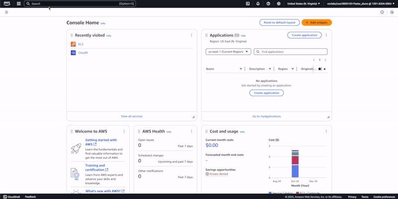

# Cloud9

Nesta etapa faremos algumas configurações na instância de onde partirá as automações dos laboratórios



Após finalizar o processo anterior um terminal será exibido dentro do Cloud9, faça uma cópia do [repositório de configuração do ambiente](https://github.com/timelapalma/sextou-no-otel) da disciplina e em seguida execute o script de instalção das ferramentas que serão usadas durante os laboratórios:

## Ajuste de sizing da IDE:

```sh
cd ~/environment
git clone https://github.com/timelapalma/sextou-no-otel

# Execute o script de instalção das ferramentas que serão usadas durante os laboratórios:
chmod +x ~/environment/sextou-no-otel/cloud9/scripts/resize.sh
bash ~/environment/sextou-no-otel/cloud9/scripts/resize.sh
```

## Instalação de Dependências:
```sh
sudo curl -L https://github.com/docker/compose/releases/latest/download/docker-compose-$(uname -s)-$(uname -m) -o /usr/local/bin/docker-compose
sudo chmod +x /usr/local/bin/docker-compose
docker-compose version
```

Pronto! 

## Subindo a stack com Opentelemetry:
A partir da raiz do projeto inicialize a stack de observability para os testes:

```sh
cd ~/environment/sextou-no-otel/laboratorio-[1..10] # Escolha conforme a etapa
docker-compose up -d
```