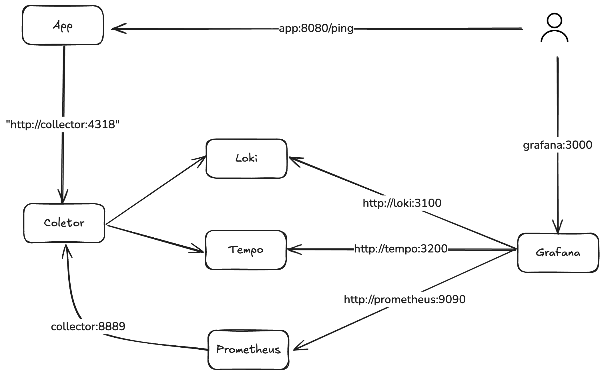

# Intro, Open Telemetry

**Conceito:**

OpenTelemetry é um conjunto de ferramentas, APIs e SDKs open-source projetado para padronizar a coleta, geração e exportação de dados de observabilidade, como logs, métricas e traces. Ele permite monitorar aplicações distribuídas de forma eficiente, independentemente da linguagem de programação ou da infraestrutura utilizada. Com suporte a diversos backends, como Prometheus, Jaeger e Grafana, o OpenTelemetry ajuda equipes a obterem visibilidade unificada sobre seus sistemas, facilitando a detecção e resolução de problemas.

**Arquitetura:**

- O spring-app é a aplicação principal, baseada em Spring, que exporta dados de observabilidade (traces) para o OpenTelemetry Collector utilizando o protocolo OTLP via HTTP. Ela expõe sua interface na porta 8080.

- O collector, utilizando a imagem do OpenTelemetry Collector Contrib, recebe, processa e exporta dados de observabilidade. Ele coleta traces da aplicação via OTLP na porta 4318 e disponibiliza métricas para o Prometheus nas portas 8888 e 8889. Além disso, pode exportar dados para Tempo, Prometheus e Loki, permitindo uma abordagem centralizada para monitoramento e rastreamento distribuído.

- O prometheus é responsável por coletar e armazenar métricas de desempenho. Ele utiliza uma configuração personalizada definida no arquivo prometheus.yml e expõe sua interface na porta 9090. Seu processo de coleta de métricas ocorre por meio de raspagem (scraping), utilizando como alvo (target) o OpenTelemetry Collector na porta 8889, garantindo a captura contínua de dados de monitoramento.

- O tempo atua como um sistema de armazenamento para traces distribuídos, recebendo dados via OTLP gRPC na porta 4317. Ele utiliza um arquivo de configuração específico (tempo.yml) para definir seu comportamento e armazenamento.

- O loki é um sistema de armazenamento e indexação de logs, projetado para integração com o Grafana. Ele expõe sua API de logs na porta 3100, permitindo que os logs da aplicação e de outros serviços sejam consultados e analisados de forma eficiente.

- Por fim, o grafana funciona como a interface principal de visualização dos dados de observabilidade. Ele permite integrar e visualizar métricas do Prometheus, traces do Tempo e logs do Loki em dashboards personalizados. A interface do Grafana é acessível pela porta 3000.

*By ChatGPT*

**Pipeline:**

Consule a estrutura do Pipeline [Clicando aqui](https://www.otelbin.io/#config=**H_Learn_more_about_the_OpenTelemetry_Collector_via*N*H_https%3A%2F%2Fopentelemetry.io%2Fdocs%2Fcollector%2F*N*Nreceivers%3A*N__otlp%3A*N____protocols%3A*N______grpc%3A*N______http%3A*N*Nprocessors%3A*N__batch%3A*N*Nexporters%3A*N__otlp%3A*N____endpoint%3A_otelcol%3A4317*N*Nextensions%3A*N__health*_check%3A*N*Nservice%3A*N__extensions%3A_%5Bhealth*_check%5D*N__pipelines%3A*N____traces%3A*N______receivers%3A_%5Botlp%5D*N______processors%3A_%5Bbatch%5D*N______exporters%3A_%5Botlp%5D*N____metrics%3A*N______receivers%3A_%5Botlp%5D*N______processors%3A_%5Bbatch%5D*N______exporters%3A_%5Botlp%5D*N____logs%3A*N______receivers%3A_%5Botlp%5D*N______processors%3A_%5Bbatch%5D*N______exporters%3A_%5Botlp%5D%7E)

- A configuração do OpenTelemetry Collector define um pipeline para coletar, processar e exportar dados de observabilidade, abrangendo métricas, traces e logs.

- Os receivers especificam como os dados são recebidos, utilizando o protocolo OTLP via HTTP (porta 4318) e gRPC (porta 4317).

- Os processors incluem um processamento em lote [batch](https://github.com/open-telemetry/opentelemetry-collector/blob/main/processor/batchprocessor/README.md), que agrupa os dados antes da exportação para otimizar o uso da API e melhorar o desempenho.

- Os exporters enviam os dados processados para diferentes destinos. As métricas são exportadas para o Prometheus na porta 8889, os traces são encaminhados para o Tempo via OTLP gRPC e também registrados no console via logging, enquanto os logs são enviados para o Loki por meio da API HTTP.

Além disso a extensão [health_check](https://github.com/open-telemetry/opentelemetry-collector-contrib/blob/main/extension/healthcheckextension/README.md) foi ativadas para fornecer funcionalidades de monitoramento da saúde do coletor.

---

Extras:

Vídeo de referência do canal [Dose de Telemetria](https://www.youtube.com/@DoseDeTelemetria) com [Introdução ao Open Telemetry](https://www.youtube.com/watch?v=fuIHvIsd_lg&t=757s);