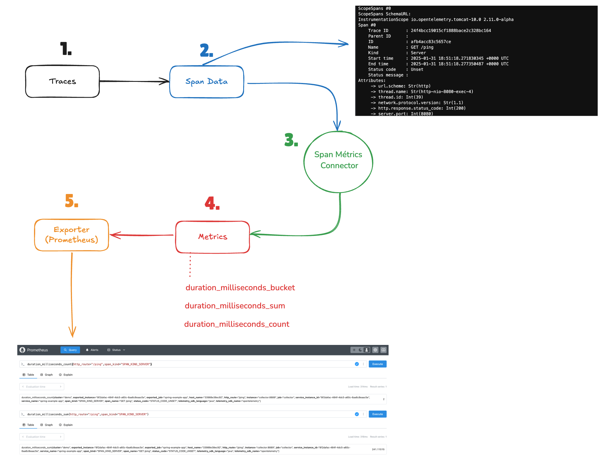

# Intro, Open Telemetry (SpanMeétrics)

**Conceito:**

O recurso de Span Metrics do OpenTelemetry permite extrair métricas a partir de spans de traces, convertendo informações de rastreamento (como latência, contagem de requisições e erros) em métricas que podem ser facilmente consultadas e agregadas. Isso facilita a análise de desempenho e a correlação entre tracing e métricas.

O fluxo de conversão ocorre nas seguintes etapas:

1. Recepção de Traces: Os traces são recebidos através do OpenTelemetry utilizando o pipeline de traces, que coleta e organiza dados de rastreamento de aplicações.
2. Os dados de spans enviados pelos traces são processados no processor batch para otimização e em seguida são enviados ao exporter otlp/tempo e ao fluxo nomeado como spanmetrics
3. Aqui entra o conversor para spanmetrics que utiliza o conector SpanMetrics para converter os traces recebidos em métricas de rastreamento, estruturando os dados para a próxima etapa.
4. Na próxima etapa a saída gerada pelo conector SpanMetrics é entregue como entrada do pipeline de métricas que fará o encaminhamento conforme a configuração desejada.
5. Na última etapa ocorre a exportação para prometheus, as métricas convertidas são então exportadas onde podem ser armazenadas e utilizadas para monitoramento e visualização de desempenho.

## Arquitetura:

- A mesma arquitetura do [laboratório-1](../laboratorio-1/README.md) foi mantida com o envio de métricas pela aplicação e acesso na porta 8080

- Atualizei o opentelemetry-contrib para a versão 0.111

- Dentro da configuração do collector adicionei o bloco connectors, os [connectors](https://github.com/open-telemetry/opentelemetry-collector/blob/main/connector/README.md) são componentes que facilitam a integração entre diferentes tipos de sinais (traces, métricas e logs) dentro do pipeline de observabilidade. Eles permitem transformar, enriquecer ou redirecionar dados entre diferentes processadores e exportadores, ajudando na conversão e interoperabilidade entre formatos.

- Em nosso laboratório o conector [spanmétrics](./docker/collector/otel-collector.yml) converterá spans em métricas.

- Consulte a [Documentação do conector spanmetrics](https://github.com/open-telemetry/opentelemetry-collector-contrib/blob/main/connector/spanmetricsconnector/README.md)

- Existem outros conectores como por exemplo o [Failover Connector](https://github.com/open-telemetry/opentelemetry-collector-contrib/tree/main/connector/failoverconnector) usado para cenários de H.A. com redirecionamento de envio nos pipelines.

## Dimensions:

No OpenTelemetry, "dimensions" são um conceito relacionado ao contexto de metadados que permitem descrever e categorizar spans e métricas. Em termos práticos, essas dimensões ajudam a identificar e diferenciar spans ou métricas coletadas em um sistema distribuído.

Dentro da configuração de span métrics é possível definir arbitrariamente quais dimensões serão mantidas e utilizadas na construção das métricas geradas pelos spans, essa opção fica no parâmetro dimensions do [arquivo do otel](../laboratorio-2/docker/collector/otel-collector.yml).

Cada dimensão adicional é definida com um nome que é consultado na coleção de atributos do span ou nos atributos de recurso (também conhecidos como tags de processo), como ip, host.name ou instance.id.

## Pipeline:

Consule a estrutura do Pipeline [CLICANDO AQUI](https://www.otelbin.io/#config=receivers%3A*N__otlp%3A*N____protocols%3A*N______grpc%3A*N________endpoint%3A_0.0.0.0%3A4317*N______http%3A*N________endpoint%3A_0.0.0.0%3A4318*N*Nprocessors%3A*N__*H_Agrupar_m%C3%A9tricas_antes_de_enviar_para_reduzir_o_uso_da_API.*N__batch%3A*N*Nexporters%3A*N__prometheus%3A*N____endpoint%3A_%220.0.0.0%3A8889%22*N____const*_labels%3A*N______cluster%3A_demo*N__otlp%2Ftempo%3A*N____endpoint%3A_tempo%3A4317*N____tls%3A*N______insecure%3A_true*N__loki%3A*N____endpoint%3A_%22http%3A%2F%2Floki%3A3100%2Floki%2Fapi%2Fv1%2Fpush%22*N*Nconnectors%3A*N__spanmetrics%3A*N____metrics*_expiration%3A_10m*N____histogram%3A*N______explicit%3A*N________buckets%3A_%5B125ms%2C_500ms%2C_2000ms%2C_8000ms%5D*N____dimensions%3A*N______-_name%3A_http.method*N______-_name%3A_http.route*N______-_name%3A_http.scheme*N______-_name%3A_http.status*_code*N______-_name%3A_net.host.name*N______-_name%3A_net.protocol.name*N______-_name%3A_net.protocol.version*N______-_name%3A_telemetry.sdk.language*N______-_name%3A_telemetry.sdk.name*N______-_name%3A_telemetry.sdk.version*N______-_name%3A_service.instance.id*N______-_name%3A_host.name*N____exemplars%3A*N______enabled%3A_false*N____dimensions*_cache*_size%3A_1000*N____aggregation*_temporality%3A_%22AGGREGATION*_TEMPORALITY*_CUMULATIVE%22____*N____resource*_metrics*_key*_attributes%3A*N______-_service.name*N*N*Nextensions%3A*N__*H_Respons%C3%A1vel_por_responder_a_chamadas_de_verifica%C3%A7%C3%A3o_de_sa%C3%BAde_em_nome_do_coletor.*N__health*_check%3A*N*Nservice%3A*N__extensions%3A_%5Bhealth*_check%5D*N__pipelines%3A*N____metrics%3A*N______receivers%3A_%5Botlp%2C_spanmetrics%5D*N______processors%3A_%5Bbatch%5D*N______exporters%3A_%5Bprometheus%5D*N____traces%3A*N______receivers%3A_%5Botlp%5D*N______processors%3A_%5Bbatch%5D*N______exporters%3A_%5Botlp%2Ftempo%2C_spanmetrics%5D*N____logs%3A*N______receivers%3A_%5Botlp%5D*N______exporters%3A_%5Bloki%5D%7E&distro=otelcol-core%7E&distroVersion=v0.111.0%7E)

---

# Extras:

Artigo da Last9 sobre o uso de spanmétrics: [https://last9.io/blog/convert-opentelemetry-traces-to-metrics-using-spanconnector/}(https://last9.io/blog/convert-opentelemetry-traces-to-metrics-using-spanconnector/);]